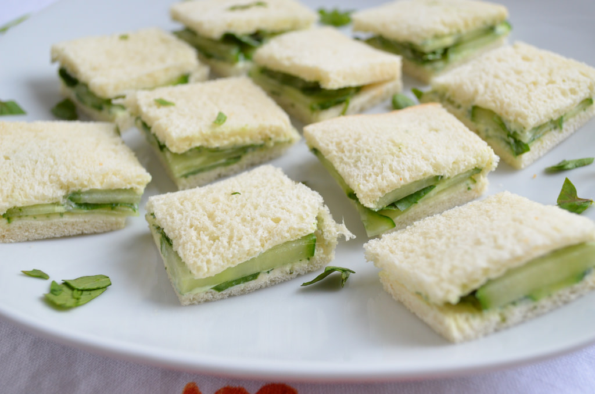

# Cucumber::Sammies



Simple & tasty step definitions for your Rails application that are meant to compliment [Speewald](https://github.com/makandra/spreewald).

## Installation

Add this line to your application's Gemfile:

```ruby
gem 'cucumber-sammies'
```

And then execute:

    $ bundle

Or install it yourself as:

    $ gem install cucumber-sammies

## Usage

To use `cucumber-sammies` in your cucumber tests, add this line to your `features/support/env.rb` file.

```ruby
require 'cucumber/sammies/step_definitions/*'
```

Or your can require individual step definition files by replacing `*` with the file name you want.

## Development

After checking out the repo, run `bin/setup` to install dependencies. You can also run `bin/console` for an interactive prompt that will allow you to experiment.

To install this gem onto your local machine, run `bundle exec rake install`. To release a new version, update the version number in `version.rb`, and then run `bundle exec rake release`, which will create a git tag for the version, push git commits and tags, and push the `.gem` file to [rubygems.org](https://rubygems.org).

## Contributing

Bug reports and pull requests are welcome on GitHub at https://github.com/[USERNAME]/cucumber-sammies. This project is intended to be a safe, welcoming space for collaboration, and contributors are expected to adhere to the [Contributor Covenant](http://contributor-covenant.org) code of conduct.

## License

The gem is available as open source under the terms of the [MIT License](https://opensource.org/licenses/MIT).

## Code of Conduct

Everyone interacting in the Cucumber::Sammies project’s codebases, issue trackers, chat rooms and mailing lists is expected to follow the [code of conduct](https://github.com/[USERNAME]/cucumber-sammies/blob/master/CODE_OF_CONDUCT.md).
